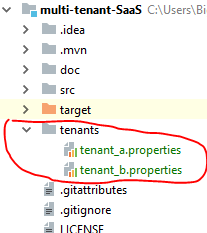

# Multi-tenant SaaS Database Tenancy Patterns

## Introduction to Database Tenancy
In the Software as a Service (SaaS) model, your company does not sell licenses to your software. Instead, each customer makes rent payments to your company, making each customer a tenant of your company.

A tenancy model determines how each tenant’s data is mapped to storage.

#### Standalone single-tenant app with single-tenant database
In this model, the whole application is installed repeatedly, once for each tenant.

 
<hr>

#### Multi-tenant app with database-per-tenant
In this model A new database is provisioned for each new tenant. 


When databases are deployed in the same resource group, they can be grouped into elastic database pools. This pool option is cheaper and still achieve a high degree of performance isolation.


<hr>

#### Multi-tenant app with sharded multi-tenant databases
This access pattern allows tenant data to be distributed across multiple databases or shards, where all the data for any one tenant is contained in one shard. Combined with a multi-tenant database pattern, a sharded model allows almost limitless scale.


<hr>
<hr>

## How to use this code

Let's imagine, we want to store some car models from two company **Tesla** and **BMD** into our database. But those will not saved in same database. Depending on the company name, our product will be switched to different database for storing.

If we use URL `localhost:8080/tesla` then our SaaS application will use `dbtenant1` database.

If we use URL `localhost:8080/bmw` then our SaaS application will use `dbtenant2` database.


First create two sample tenant database named `dbtenant1`  and `dbtenant2`. For simplicity, we will create one `product` table in both database. 
```sql
create table product
(
  id    int  auto_increment  primary key,
  name  varchar(255) null,
  price float        null,
  code  varchar(255) not null
);
```

Two tenant database properties are kept inside `tenant` folder in project root location. 




These properties files have very simple structure. For example `tenant_a.properties` looks like this
```properties
name=tesla
datasource.url=jdbc:mysql://localhost:3306/dbtenant1
datasource.username=root
datasource.password=
```
Here, `name=tesla` key will map `dbtenant1` database. So, if you need more tenant database, just create one more properties file.

We are going to store car information in our SaaS Application. So, we will create a POST request containing some JSON value.

  
The controller is very simple. It receive a path variable which is the name of our tenant key (`tesla` or `bmw`).
Then tenant key is saved in ``ThreadLocal`` so that it will only accessible from current request thread, and will not mix with other person's request. 
```java

@RestController
public class CompanyController {

    @Autowired
    ProductRepository repository;

    @RequestMapping(value="/{company}", method=RequestMethod.POST)
    public Object findOwner(@PathVariable String company, @RequestBody Product product) {

        // set the company name(tenant name)
        TenantContext.setCurrentTenant(company);

        // create dummy product code
        product.setCode( company + "_" + new Random().nextInt(100));

        // save to database
        Product savedProdict = repository.save(product);

        return savedProdict;
    }
}

```


```java


```

### Reference 
[Multi-tenant SaaS database tenancy patterns - microsoft](https://docs.microsoft.com/en-us/azure/sql-database/saas-tenancy-app-design-patterns)